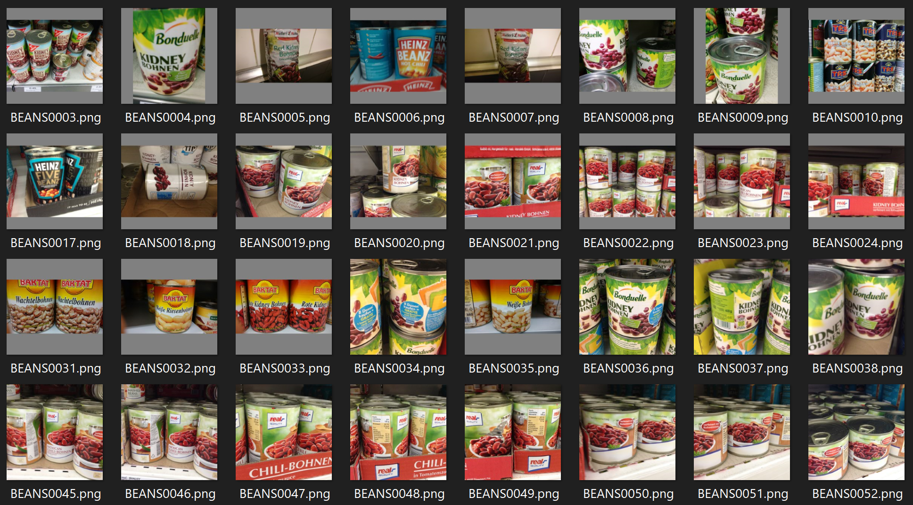

  

# Recognizing Groceries

This dataset1 contains 25 classes of images (256x256 RGB .png files) depicting various products for sale at grocery stores. 

The data can be used to build and train an ML model that classifies various groceries for use in computer vision applications (e.g., retail and robotics).

# Structure

This repo contains the following structure:

- **/data/frieburg_log.csv**: CSV file that maps grocery classification numbers to the training images.
- **data**: contains the training images, partitioned into sub directories for the respective classifications. The following are a few example images:

  

The table below shows a partial example of the data stored in **frieburg_log.csv** that is used to map classification numbers to training images:

| **image_path**  | **target** |
| ----------  | ---------- |
| BEANS/BEANS0000.png | 0 |
| CAKE/CAKE0082.png | 1 |

The labels used in the CSV are:

- **0**: Beans
- **1**: Cake
- **2**: Candy
- **3**: Cereal
- **4**: Chips
- **5**: Chocolate
- **6**: Coffee
- **7**: Corn
- **8**: Fish
- **9**: Flour
- **10**: Honey
- **11**: Jam
- **12**: Juice
- **13**: Milk
- **14**: Oil
- **15**: Pasta
- **16**: Rice
- **17**: Soda
- **18**: Spices
- **19**: Sugar
- **20**: Tea
- **21**: Tomato Sauce
- **22**: Vinegar
- **23**: Water
- **24**: Nuts

# Community

Got questions, feedback, or want to join a community of machine learning practitioners working with exciting tools and projects? Check out our [Community](https://forum.perceptilabs.com/)!

1 Dataset Credits: http://aisdatasets.informatik.uni-freiburg.de/freiburg_groceries_dataset/

